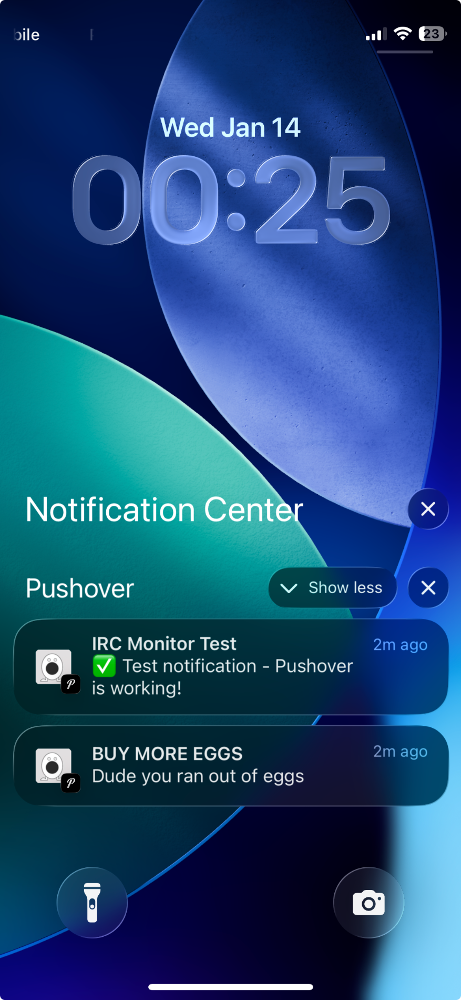

# irc-topic-notify

[](https://github.com/ggfevans/irc-topic-notify/actions/workflows/test.yml)
[](https://opensource.org/licenses/MIT)
[](https://www.python.org/downloads/)

Topics are important. People change them and then what? You're supposed to just know? You're supposed to be watching the channel 24/7? You have a life. You have things to do.

This bot watches IRC channel topics so you don't have to. When the topic changes to something you care about, you'll know. Immediately. [Pushover](https://pushover.net) notification straight to your phone.

<p align="center">
  
</p>

## Use Cases

- **Game server status**: your server's IRC channel topic changes to "ONLINE" and you're not there? Unacceptable. Now you'll know.
- **Incident response**: team channel topic changes to "INCIDENT IN PROGRESS" at 3am? You'll know. Immediately.
- **Community events**: someone updates the topic to "LIVE NOW" and you miss it? Not anymore. That's the whole point of this.

## Features

- **Simple trigger matching**: case-sensitive or case-insensitive phrase detection
- **Pushover notifications**: customizable title, message, and URL
- **Notification cooldown**: prevents spam from rapid topic changes
- **Auto-reconnect**: handles disconnections gracefully
- **Systemd ready**: includes service file for daemonized operation
- **Docker support**: run with docker compose or standalone container
- **Read-only**: bot never sends messages to the channel. It just watches. Quietly. Professionally.

## Requirements

- Python 3.8+
- Pushover account ($5 one-time, 30-day free trial)

## Quick Start

```bash
# Clone
git clone https://github.com/ggfevans/irc-topic-notify.git
cd irc-topic-notify

# Setup
python3 -m venv --upgrade-deps venv
source venv/bin/activate
pip install -r requirements.txt

# Configure
cp config.example.py config.py
# Edit config.py with your IRC server, channel, trigger phrase, and Pushover tokens

# Test Pushover connection
python irc_topic_notify.py --test

# Test trigger detection
python irc_topic_notify.py --test-trigger "Status: OPEN"
python irc_topic_notify.py --test-trigger "Status: CLOSED"

# Run
python irc_topic_notify.py
```

## Configuration

Edit `config.py` with your settings:

| Setting | Description |
|---------|-------------|
| `IRC_SERVER` | IRC server hostname |
| `IRC_PORT` | SSL port (usually 6697 or 7000) |
| `IRC_CHANNEL` | Channel to monitor (include `#`) |
| `IRC_NICKNAME` | Bot's nickname |
| `TRIGGER_PHRASE` | Phrase to watch for |
| `TRIGGER_CASE_SENSITIVE` | Case-sensitive matching (default: `True`) |
| `PUSHOVER_APP_TOKEN` | Your Pushover app token |
| `PUSHOVER_USER_KEY` | Your Pushover user key |
| `NOTIFICATION_COOLDOWN_MINUTES` | Minimum time between notifications |

## Server Deployment

```bash
# Install
apt update && apt install -y python3 python3-venv git
useradd -r -m -s /bin/bash ircmonitor
git clone https://github.com/ggfevans/irc-topic-notify.git /opt/irc-topic-notify
chown -R ircmonitor:ircmonitor /opt/irc-topic-notify

# Setup venv
sudo -u ircmonitor bash -c 'cd /opt/irc-topic-notify && python3 -m venv --upgrade-deps venv && venv/bin/pip install -r requirements.txt'

# Configure
sudo -u ircmonitor cp /opt/irc-topic-notify/config.example.py /opt/irc-topic-notify/config.py
sudo -u ircmonitor nano /opt/irc-topic-notify/config.py

# Test
sudo -u ircmonitor /opt/irc-topic-notify/venv/bin/python /opt/irc-topic-notify/irc_topic_notify.py --test

# Install and start service
cp /opt/irc-topic-notify/irc-topic-notify.service /etc/systemd/system/
systemctl daemon-reload
systemctl enable --now irc-topic-notify

# Monitor
journalctl -u irc-topic-notify -f
```

## Docker

```bash
# Configure first
cp config.example.py config.py
# Edit config.py with your settings

# With docker compose
docker compose up -d

# Or standalone
docker build -t irc-topic-notify .
docker run -d --restart unless-stopped -v $(pwd)/config.py:/app/config.py:ro irc-topic-notify
```

## Pushover Setup

1. Sign up at [pushover.net](https://pushover.net) (30-day free trial, then $5 one-time)
2. Create an application at [pushover.net/apps/build](https://pushover.net/apps/build) → copy the **API Token**
3. Copy your **User Key** from the Pushover dashboard
4. Add both to `config.py`

### Test Pushover (without the bot)

```bash
curl -s \
  --form-string "token=YOUR_APP_TOKEN" \
  --form-string "user=YOUR_USER_KEY" \
  --form-string "message=Test notification" \
  https://api.pushover.net/1/messages.json
```

## Troubleshooting

| Issue | Solution |
|-------|----------|
| `Config error: PUSHOVER_APP_TOKEN not configured` | Edit `config.py` with your real tokens |
| `Nickname in use` | Change `IRC_NICKNAME` in `config.py` |
| Connection timeout | Check firewall allows outbound traffic on the IRC port |
| No topic shown | Channel may not have a topic set |

## Development

```bash
# Install with dev dependencies (assumes venv created with --upgrade-deps)
pip install -e ".[dev]"

# Run tests
pytest

# Run tests with coverage
pytest --cov=irc_topic_notify --cov-report=term-missing
```

## License

MIT License - see [LICENSE](LICENSE)

## Contributing

Issues and PRs welcome. See [CONTRIBUTING.md](CONTRIBUTING.md) for guidelines.

---

Built with [Claude Code](https://claude.ai/code) 🤖
